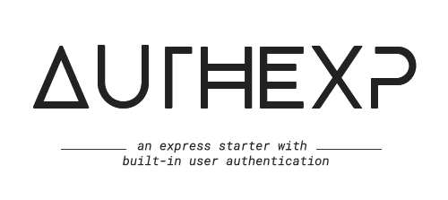

# AuthExp 🔐

<p align="center">
  
  
  
  
  
</p>

<p align="center">
  
</p>

***✔️ A simple, intuitive and ready to use MVC express starter with user authentication handled for you.***

***✔️ Highly customizable to suit your needs. Can be extended to a REST API or to a full fledged server/client side rendering webapp.****

## 01. Introduction 🚀

User authentication and storage is one of the most common and fundamental tasks for any project. But it takes a lot of time, precautions & testing to set it up reliably and securely.

This starter app was created to solve this issue precisely. It helps you quickly bootstrap your Node + Express projects with all user authentication & storage factors handled. So that you can focus on the core logic of your project, rather than the tedious and repetitive task of setting up authentication.

This starter app has built-in core support for:

- Login users using *username* + *password*
- Sign-in / register new users.
- Password reset and forgot password.
- Updating, deleting and fetching users.
- User profile images.
- Express middlewares for protected and role-specific routes

All routes of this app have been thoroughly tested with many security middlewares and request headers in place. Feel assured that your project's authentication is secure and reliable.😄

## 02. Setup 🏗️

1. Add environment variables to the ```setup-config.txt``` file at the root of the directory and follow the instructions specified. Rename that file to ```.env``` after making the changes. [dotenv](https://www.npmjs.com/package/dotenv) is being used to parse these environment variables.

2. Install all dependencies using npm by running:  ```npm i``` from the root of the directory.

3. Scripts have been provided for easier use.
    - ```npm run dev``` : Starts the server on the specified port using [nodemon](https://www.npmjs.com/package/nodemon). Every save will refresh the server.
    - ```npm start``` : A script which runs the app in production using node. Mostly used for heroku or other hosting platforms after being built there to start the server.

## 03. MVC Structure ⚙️

1. The MVC architecture splits your application files broadly into 3 components - Models, Views and Controllers.
    - Models: The database schemas or guidelines which control the data being stored in the database. It is responsible for data validations.
    - Controllers: This part of the application can be split into routes and controllers.
      - Routes: The different API endpoints of your http server.
      - Controllers: The functions which would actually handle all requests coming to these endpoints and provide a response.
    - Views: These consist of the frontend of the app. If your app is a server-side-rendering app this would most probably consist of templates/views written in pug, ejs etc.
2. You can read more about the MVC architecture [here](https://www.geeksforgeeks.org/model-view-controllermvc-architecture-for-node-applications/)
